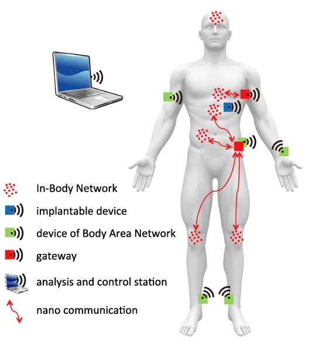
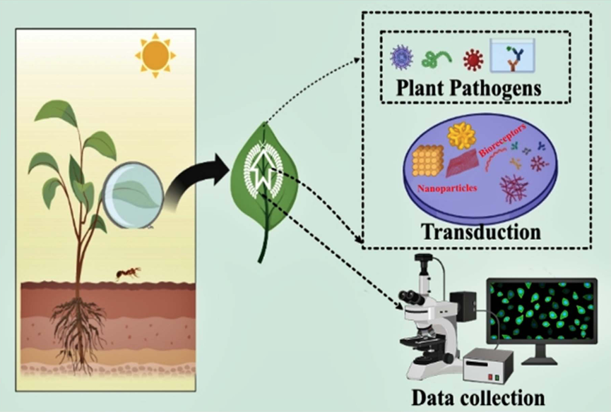
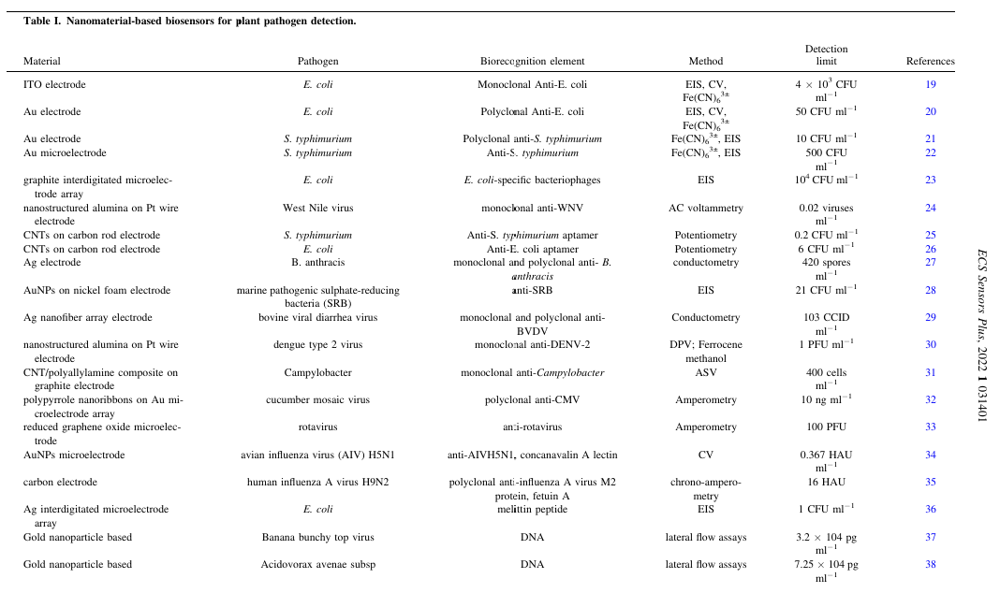
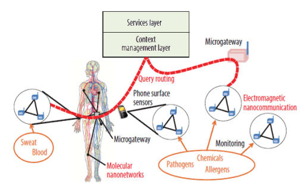

# Article 2: Connecting in-body nano communication with body area networks: Challenges and opportunities of the Internet of Nano Things
While research and development for Body Area Networks has gained maturity in recent years, In-Body Networks built from nano machines represent a new and fascinating direction of research.

Body Area Networks are able to measure all kinds of body parameters, but as the name says: from the outside. They are able to do what physicians do with their regular tools such as tongue depressors or thermometers. Many more parameters are available inside the body, such as, for instance, blood and liver characteristics. Today, these values are examined in the lab, taking blood samples from the patient. The vision of In-Body Networks is that tiny devices, so-called nanomachines, will patrol in the body, take measurements wherever necessary, and send collected data to the outside. Even better, if we consider actuators connected to the sensors, it will be possible that these machines immediately work on problems they detect within the body, such as cancer cells, arteriosclerosis, or HIV viruses.

However, there are risks. Just to mention one: as soon as an In-Body Network can be controlled from the outside, there is always a risk that this will be done by non-authorized entities-be it people or be it machines. This obviously has to be avoided.

Most laws and directives sort all medical devices into risk categories, the category to be selected mostly depending on the duration of the body contact, the invasive character of the device, its implantability, its influence on body functions, etc. One can safely assume that IoNT systems (as well as In-Body Networks themselves) will be classified in the highest risk category-one could even speculate if, once such networks are really available, a new category will be introduced. As a consequence, there are extremely high requirements on the development process of such devices as well as on their operation. The highest goal is the protection of human life and a clear liability if something bad happens. A medical device manufacturer who can prove that he followed all necessary steps required by the law will not be held liable in such a case.

While there are no good reasons for using nano devices outside the body (at least not in biomedical applications), the other way around makes sense and is already in use. Think, for instance, of an implanted drug pump, which could be instructed to dispense parts of its content when the IoNT considers it necessary, or of a heart pace maker which could be regulated in its frequency. While in the first two cases described above, it seems quite obvious that a gateway between In-Body Network and Body Area Network is located outside the body, one could think of different solutions in the mixed case.

Body Area Networks have been deeply investigated and have become reality already. In-Body Networks, however, are still mostly a vision. There are quite a few ideas of how they could become reality, but it is still a long way to go. In addition, nearly all the work done so far has been on the physical layer and some on the link layer, but there is not much to be found on the higher layers.
A possible architecture there would consist of one Body Area Network wirelessly connecting all (micro) devices which are located outside the body. There may also be further micro devices implanted in the body which are also connected to the Body Area Network. Within the body, there will be a number of nano device networks all operating in a certain area and specialized on certain functionalities and jobs. Furthermore, there is one more powerful device which is able to analyse data from both network types and send commands to actuators also in both network types. It does not matter if this device is part of the Body Area Network or rather connected through some other kind of wireless radio technology. Finally, these networks will be interconnected through a gateway.

The figure below shows an overview of our envisioned IoNT architecture integrating In-Body Nano Communication Networks with Body Area Networks.

The integration of Body Area Networks systems within body devices and nanomachines also creates a completely new level of security related challenges. IoNT systems establish a direct target for a variety of potential attacks. Such attacks may include
- the theft of private data, e.g., physiological data collected by either in-body or wearable sensors that must not leak the system;
- the disruption of medical applications, e.g., dedicated drug delivery applications controlled and coordinated by wearable computer;
- the targeted modification of communication links on the nano communication level or at the gateway to the Body Area Network.

In order to achieve a certain level of security, IoNT systems need to rely on a broad mixture of security solutions. Unfortunately, classical end-to-end security associations will not be applicable due to both the computational capabilities of nano devices as well as the very limited data rates in In-Body Networks. Thus, the discussed gateways will need not only to act as application layer translation systems but also to switch between different security solutions:
- Cryptographic primitives. In the scope of Body Area Networks, we can rely on classical cryptographic solutions such as using the symmetric AES or the asymmetric RSA algorithms. For In-Body Nano Communication, however, we need more lightweight solutions such as the biochemical cryptography
- Key management-Creating and exchanging keys between the Body Area Network and the In-Body Nano Communication. The gateway will also play a dominant role in this aspect. The gateway will have to part of a (possibly larger) PKI system. Also, the type of keys used will strongly depend on the employed communication techniques.
- Authentication and access control. All messages to be forwarded by the gateway to the In-Body Nano Communication system of course need to be authenticated in order to prevent misuse.
- Performance. For sensor and body area networks, it has been shown that even rather fast cryptographic algorithms become limiting factors This will be even more critical in IoNT systems and must be addressed when designing particularly the gateway nodes.

In conclusion, in-Body Nano Communication has become an established research field enabling a wide range of new solutions, especially for medical and fitness applications. Operation and control of in-body nano systems strongly depends on car fully managed information from physiological parameters and external control. Here, established Body Area Network technology can be used to provide both communication capabilities, e.g., to a physician, as well as storage and processing features.

# Article 5: A Paradigm of Internet-of-Nano-Things Inspired Intelligent Plant Pathogen-Diagnostic Biosensors
Plant pathogens massively affect crop productivity and are one of the significant challenges in attaining sustainable development goals related to agriculture, food production, and addressing hunger issues. Conventional techniques of generic seasonal chemical spraying severely damage the environment and human health. On the contrary, nanomaterials-based biosensors have emerged as economical, efficient, selective, prompt, and precise strategies for plant pathogen and disease diagnosis. The integration of nano biosensors with artificial intelligence, internet-of-things, cloud computing, drones, and 5G communication has recently raised the paradigm of internet-of-nano-things-inspired intelligent plant-diagnostic biosensors.

The need to increase agricultural output and ensure the safety of the food supply is rising to meet the demands of a rapidly expanding global population. It is widely accepted that plant diseases contribute to the world’s dismal agricultural production. These hostile plant pathogens, including viruses, fungus, and bacteria are seen as disruptive outside influences with the ability to cause a wide range of plant infections and reduce crop yields.

The most conventional used for plant pathogen and resulting symptoms and disease diagnosis is their visual identification necessitating a practiced plant grower or pathologist. However, it is ineffective in detecting pathogens’ presence in the early infection phases when plant infections show no outward signs. There are now three distinct molecular tests that have been used. All of them are based on either proteins or nucleic acids. However, these methods are costly, time-consuming, and labour-intensive, hindering the early stage, cost-effective and rapid pathogen diagnosis necessary for diversified crops. Moreover, significant effort must be made to optimize individual plant monitoring at the site.

Biosensors have emerged as cutting-edge detection techniques used in a wide variety of scientific investigations, from airborne pathogen detection to environmental monitoring to the real-time human blood components detection for the recognition of infections and pesticide in plants and animals. It is a diagnostics device that generates an electrical signal by integrating a biological sensing element and physicochemical transducer when coming into contact with a target analyte or pathogen.

As a result, a transducer takes a biomolecular interaction and turns it into a digital signal. An antibody, D.N.A., enzyme, tissue type, complete cell, etc., may all perform the function of a bioreceptor. The bioreceptor’s specialized biochemical interaction gives the biosensor its recognition specificity. A biosensor may be either electrochemical, optical, thermal, or piezoelectric, depending on its transducer. Biosensing approaches for plant pathogen detection have been feasible over the last several decades, with significant diagnostic findings achieved in real-world applications.
The advancements in their sensitivity, detection range, and response time have resulted in the widespread usage of biosensors for agricultural practices in recent years.

Due to the nanomaterial’s quick reaction times and developments in the design of tiny and portable sensors, remote and on-site plant health monitoring is much improved, allowing for the estimate or early detection of plant illnesses. These characteristics, combined with a wide range of optical and electrical properties, provide promising optical, electrochemical, and electronic sensing systems. Integrating nanotechnological tools has revolutionized plant biosensing strategies to detect and monitor a diversified range of plant pathogens. For instance, various nanostructures can be used to create biosensors with enhanced performance in terms of sensitivity, selectivity, and limit of detection, opening the door to manufacturing devices for on-site detection. Binding sites for bio-specific immobilization can be achieved using electro spun nanofibers or metallic nanoparticles, which can alter their surface functionality. Molecularly imprinted polymer (M.I.P.) allows the sensor’s selectivity to be fine-tuned by interacting only with the target analyte and blocking out noise. These cases show the potential of nanotechnology’s flexibility, which may be used to create biosensors with superior performance.
It is becoming clear that devices based on nanomaterials-based biosensors provide a good replacement for the conventional, time-consuming techniques of identifying infections

## Types of biosensors
Depending upon the detection signal, the biosensors can be classified as
- electrochemical
- optical
- acoustic
- calorimetric
- mass sensitive
- electrical biosensors.

### Electrochemical biosensor
An electrochemical biosensor consists of a working electrode, the primary component of most electrochemical cells, and serves as the electrochemical biosensors’ transduction element. Potentiostatic systems typically need a set of three electrodes (working, auxiliary, and reference), whereas conductometry an electrochemical impedance spectroscopy often only requires two electrodes (working an auxiliary) (E.I.S.). A charge is transferred from one electrode to another by the flow of electrons and holes. For this reason, electrodes are made from metals like gold (Au) and nonmetals like carbon, which are both conductive and semiconducting in electrical nature. Therefore, electrodes may be categorized based on the materials used, fabrication technique, and their architect.

The performance of a biosensor, including its selectivity, sensitivity, dynamic range, and the limit of detection (L.O.D.), is determined by the structure and characteristics of the electrode, which in turn are affected by the material manufacturing process, and design. Metals are often deposited on insulating surfaces using conventional microfabrication techniques like physical vapodeposition and screen printing to create thin-film metal electrodes. The final transducer element is usually completed by embedding the conducting components in an insulating polymer or ceramisubstrates such as polyether ketone (P.E. K.), Teflon, or glass.

For electrochemical biosensors, biorecognition components may be classified as either (1) biocatalytic or (2) biocomplexing. Enzymes serve as biorecognition components in a wide range of biochemical sensing applications; however, they are usually introduced as labels in the recognition of pathogen settings, typically via secondary binding stages. When analytes interact with macro molecules or ordered molecular assemblies, biocomplexity biorecognition components trigger a response in a biosensor. Functionalized electrodes may be used in various electrochemical procedures, allowing for the detection of pathogens.

### Optical biosensor
An optical biosensor includes a light source, a medium for transmitting light, a biorecognition element that has been immobilized, and a signa detection mechanism. Together, they help determine the strength of a given analyte’s binding to a certain ligand. The biorecognition process generates a physicochemical conversion (change), which is quantified by measuring the resulting light’s amplitude, phase, and frequency.

### Calorimetric biosensors
Calorimetric biosensors, biosensors based on the surface plasmon resonance, and fluorescence-based assays are the most prevalent types of optical biosensors designed for plant pathogen detection.

### Colorimetric biosensors
Colorimetric biosensors often enable the user to identify harmful bacteria in a few samples in as little as 10–15 min by observing a colour change in the samples. This assay may be performed in either a flat-based or solution-based format.

All these modules of biosensors based on nanomaterials have been utilized to detect various plant pathogens and diseases as summarized in the table above.

## Integration of Modern-age Technologies
A newly developed service, such as Cloud-IoT, enables a no-cost web service that facilitates the plug-and-play installation of remotely located sensors. Since farmers have started using new techniques that have enhanced crop yields, farming has become more accessible thanks to technological advances. The IoTs contains sensors, robots, mobiles and drones linked over the internet to work automatically and semiautomatically to execute many functions and gather data to enhance productivity and accuracy. Artificial intelligence (A.I.) tools are used in "smart farming" to monitor and analyse a farm’s environment to make informed planting and crop selection decisions based on factors such as soil type, weather forecasts, water availability, and more.

Plants that are under stress generally have a different "classification" than plants that are not under stress. This can be easily taken by using IoNT-integrated biosensors with the assistance of AI, drones, 5G communication, and machine algorithms. These concerns, if given strategic consideration, will aid in the development of superior nanosensor products and their eventual incorporation into the agricultural ecosystem.

Razzberry, a company based in the United States, created handheld chemical nanosensors to supervise chemical shifts in water and soil in real-time.
Nasys, an Italian startup, also developed a nanosensor based on metal oxides to measure air pollution.
Startups like Tracense and nGageIT are developing nanosensor innovations to trace harmful biological and chemical contaminants in food production.

## Future Needs and Prospects
Recent advancements in nano- and micro technologies have allowed the creation of plant-based biosensors that are extremely sensitive, fast, and selective.

There are some challenges that we have to overcome nanomaterials may be toxic, genetically modified due to a combination of plants, and generation of e-waste due to the use of IoT, and slow detection time. Alternative for these challenges is: toxicity can be reduced by functionalizing nanomaterials with biocompatible materials like P.E.G., green synthesis can be used in the fabrication of nanomaterials, use of the A.I. technique to know the interaction between nanomaterials and plant to observe genetic modification, and use of biocompatible materials to form sensors repurpose, reuse, degradable or recyclable material.

The sustainable development goals that can be achieved through IoT nanomaterial-based biosensors are smart farming, reduction of human resources, preservation of crops, and food chain.

Internet-of-nano-things-inspired biosensors with the assistance of drones, AI, and cloud computing are rapidly transforming the traditional methods of plant-disease diagnosis. By properly identifying the kind and location of hiccups, this monitoring even helps define the development of agricultural plants. In the end, it makes use of smart sensors to provide precise data that grants heightened production by assisting farmers in making sensitive recovery decisions. Smart nanosensors, in particular, have begun to prove themselves to be indispensable instruments for supporting agricultural sustainability because of their high sensitivity and their judicious use.

Researchers have shown that biosensors and nanosensors may increase crop yields. These real time sensors are able to detect changes in soil temperature, soil health, soil moisture content, and the soil’s microbiological state and nutritional status. Pesticide residues, heavy metals, plant diseases, fertilizer, toxin quantification, and monitoring have all been detected by these sensors.

Technology mobilization will also benefit from the development of multi-entity detectable, broad-spectrum nanosensors. Some have speculated that in the not-too-distant future, we may be able to create super "new nanomaterials" that will vastly increase the performance of biosensors.

# Article 7: "A review on Internet of Things (IoT), Internet of Everything (IoE) and Internet of Nano Things (IoNT)"
The Internet of Things (IoT), Internet of Everything (IoE) and Internet of Nano Things are new approaches for incorporating the Internet into the generality of personal, professional and societal life.

The term 'Internet of Things' or 'Internet of Objects' has come to represent electrical or electronic devices, of varying sizes and capabilities, that are connected to the Internet.

As with any new technology, there is usually some inertia in the pace of its uptake. Currently the largest three impediments are due to technological factors and not human resistance, these being: 
1. standardization of protocols
2. implementation of IPv6
3. power needed to supply the sensors

The 'Internet of Everything' is built upon the "four pillars" of people, data, process and things. Whereas IoT is only composed of "things", IoE also extends business and industrial processes to enrich the lives of people.

The concept of IoE is being extended to its fullest by the implementation of the 'Internet of Nano Things' (IoNT). This is achieved by incorporating nano-sensors in diverse objects and through the use of nano-networks. A model of this concept as a medical application provides access to data from places previously impossible to sense or from instruments inaccessible due to sensor size. This will enable new medical and environmental data to be collected, potentially leading to refinement of existing knowledge, new discoveries and better medical diagnostics.

Much research is being conducted in the field of loT in the three domains of the user experience, engineering and design. The emphasis is particularly on the end-user and accessibility.

In order for the objects that compose the IoT to acquire 'ambient intelligence' they must comprehend the end user as completely as possible. This may be achieved by observing, monitoring and recording the human users': body movements, gestures, location, context and environment. This will be likely to lead to high levels of user support that were unknown previously in computing history. The understanding of neuroscience, psychology and human behaviour will thus play an increasingly critical role in achieving device ambient intelligence. The devices must use Artificial Intelligence to understand how humans process information and interact appropriately within the right social context and multi-user scenarios.

Due to the successful deployment of various novel, innovative and useful applications, the usage of computing devices and the Internet, by people from different cultures, socio-economic backgrounds, nations, religions and geographical diversity - is increasing at a near exponential rate.

It is quite impossible to precisely point out where the current development in mobile applications, computer vision, consumer electronics, Artificial Intelligence and so forth will lead us. Despite some negative aspects of this technological evolution, we can be optimistic about the coming computer revolution as technologies are becoming more affordable, convergent and novel in their solutions.

Understanding and interpreting these trends is strongly dependent on insights in classifying different aspects, such that links between those that are similar are clearly identified but differences between those that merit differentiation are also identified. In this connection, the separation between IoT, IoE and IoNT is seen to be a helpful differentiation that should aid insights in prediction of the near future.

# Article 9: The Internet of Bio-Nano Things - Smart Computing in the Human Body
The Internet of Bio-Nano Things (IoBNT) is an innovative field of research located at the intersection of nanotechnology, biotechnology and information and communication technologies. It aims to enable the seamless integration of biological and nanoscale systems into the Internet in order to develop advanced biomedical applications, environmental monitoring sensors and energy-efficient networks. At the core of IoBNTare biocompatible nanodevices that can function in living organisms to monitor or modify specific biological processes in real time. These devices communicate with each other and with the Internet to collect, process and transmit data, opening up entirely new possibilities for health monitoring, disease control, environmental protection and many other areas.