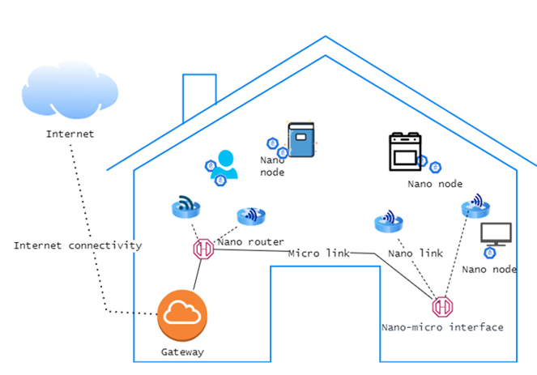
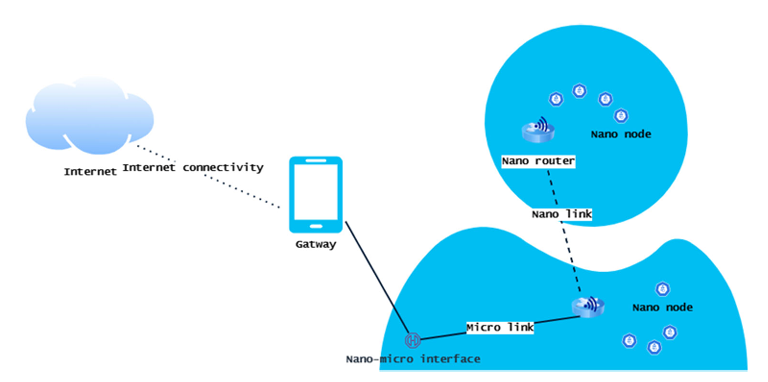

# Articolo 1

The IoT is a key technology that interconnects every digital device, allowing a machine-to-machine communication. The IoT on the nanoscale is called Internet of Nano-Things and these two technologies can be merged into the single term Internet of Everything. 

The IoNT is similar to the IoT but on a nanoscale (a nanoscale devices is between 0.1 and 100 nanometers). It is evident that these devices have the potential to revolutionize a wide range of industries such as agriculture and healthcare.

### History of the IoNT
The idea of nanotechnology is born in 1959 and since then, it has offered improved and effective solutions for various industries such as healthcare, agriculture, and so on. 51 years later, in 2010, the concept of the IoNT was developed from the Georgia Institute of Technology.  

### Why IoNT?

The IoNT is envisioned as being composed of nanoscale networks of physical items that are able to exchange information with one another via the use of nano-communication protocols. It has the potential to significantly enhance the capabilities of the IoT, for example because the devices are much smaller and more efficient than their macroscale counterparts, so they are ideal for use in applications where space is limited or where precise control is needed. 

### IoNT architecture

In general, the IoNT infrastructure can be deployed by combining nanodevices with the IoT, sensor networks, cloud computing and big data analytics. In particular, the IoNT's architecture is composed by:
* **Nanosensors and nanoactuators**
* **Specific communication protocols** like nanowires or NFC.
* **Data processing and storage** due to the large amount of data generated.
* **Network infrastructure** that may include both traditional networking technologies and specialized ones designed for nanoscale.
* **Nanomachines**, composed by a **Control Unit**, that regulates all other nanomachine components and acquires environmental data, **Communication Unit**, responsible for sending and accepting data, and **Reproduction Unit** that creates component of the nanomachine using external components and assembles them to produce the nanomachine.

For example we can see the architecture of the IoNT applied on a smart home, with nano routers and nano nodes, or on a human body, with the interface with the smartphone as a gateway.

### Application examples of IoNT
Now we'll see a brief overview of the applications of the IoNT on different domains:
* **Smart cities**: it helps to gather real-time data that may then be used to enhance public utilities, services, infrastructure and much more in the context of a smart city. 
* **Oil and Gas**: it offers convenient solutions to locate underground oil with high accuracy. The ability of nanosensors to pass through rock holes effectively helps to find oil bound ti the rocks.
* **Agriculture**: farmers are able to collect extensive data to optimize their processes. Nanosensors can be used to track the location of farm animals such as cattle, control the feed and keep a close eye to the animals health, with nanoscale biosensors injected inside them.
* **Healthcare**: the domain wherein IoNT is most used, with Body Sensor Networks (BSN) that can help to monitor human health and get diagnostically valuable data that are outside the scope of traditional diagnostic methods.
* **Environmental monitoring**
* **Manufacturing**
* **Transportation**
* **Energy**
* **Military**

### Benefits of the IoNT
In each domain, depending on the context, the IoNT performed better of the IoT. The potential benefits are:
* **Improved accuracy and precision**: nanoscale devices can be used to measure and monitor at a much higher level of accuracy.
* **Increased sensitivity**: nanodevices are enabled to detect and respond to changes in the environment that would be imperceptible to larger devices.
* **Energy efficiency**: they can operate on very low levels of power.
* **Enhanced functionality**: nanodevices can be designed to perform a wide range of functions such as sensing, computing and communication.
* **Miniaturization**: the key advantage, leads to the development of wearable or implantable IoT devices that are less obtrusive.
* **Improved durability**: often nanodevices are more resistant to damage and wear than their larger counterparts.

The IoNT has the potential to revolutionize many different industries and areas of society by building a vast network of interconnected devices and sensors on a nanoscale.

## Security and privacy of IoNT

The IoNT is plagued by a number of obstacles that need to be overcome. Among such challenges, difficulty in controlling and communicating with such small devices and concerns regarding the potential safety and environmental impacts of nanotechnology have become key research areas. IoT and IoNT have the key characteristic to be connected to the Internet. This provides an opportunity for hackers to gain access to and control nanodevices. Because these devices are often embedded in or integrated with larger systems, a breach of a single device could have far-reaching consequences, compromising the security and privacy of such larger systems. There are some challenges in IoNT that contribute to the difficulty of the assurance of security and privacy, for instance:
* **Resource limitation**
* **Exposure to the Internet**
* **Lack of encryption**

### Security risks of IoNT
The IoNT is subject to various security risks, owing to its inherent vulnerabilities. They can be:
* **Physical/Hardware security**: because of their size, this devices are vulnerable to physical tampering and damage.
* **Network security**: they can be vulnerable to hacking and other cyber-threats.
* **Data privacy**: the data collected by IoNT devices may be sensitive and protecting these data from unauthorized access is deemed essential.
* **Software vulnerabilities**: as in the case for any other software that can be exploited by hackers.

### Privacy risks of IoNT
Nanodevices can pose privacy risks if they are not properly secured, for instance:
* **Data collection**: they can collect and transmit a large amount of data about their surroundings and the people who come into contact with them.
* **Data security**: they are vulnerable to hacking and data breaches.
* **Location tracking and surveillance**: they may be equipped with GPS or other location-tracking technology, and they can allow someone to track an individual's movement in real time.
* **Lack of regulation**

### Important security goals for IoNT
There are some points that should be improved to develop a good IoNT system. They are:
* **Confidentiality**: avoiding the exposure of sensitive information to third parties who are not authorized.
* **Integrity**: data must not be altered in transit.
* **Availability**: a malicious user must never be able to interrupt or negatively impact the communication.
* **Authenticity**: the source of transmission should be reliable and should prevent the attacker from sending bogus messages. 

### Countermeasures
To address the security and privacy issues, the key points to be implemented should be:
* Implement secure communication protocols.
* Use robust authentication methods.
* Use firewalls, intrusion detection and prevention systems.
* Regularly update software and firmware.
* Use network segmentation to limit the scope of potential damage.
* Use trusted hardware security modules to store sensitive data.
* Use access controls and role-based access.
* Conduct regular security audits and penetration testing to identify vulnerabilities.
* Implement data privacy measures such as data encryptions, for example with new technologies as biochemical cryptography.
* Use anti-malware software.
* Have an incident response plan in place to quickly respond and mitigate any security breaches.
* Regularly train employees on best practices and policies regarding security. 