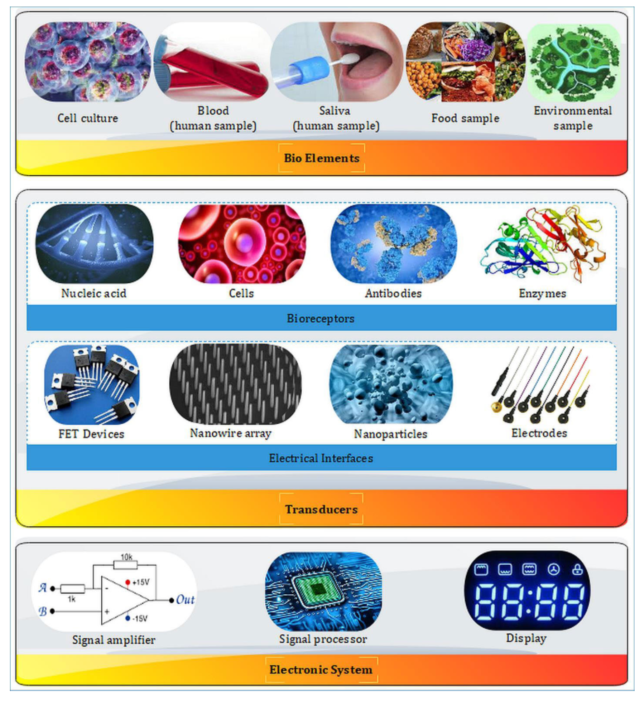
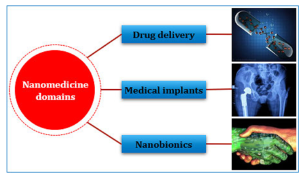
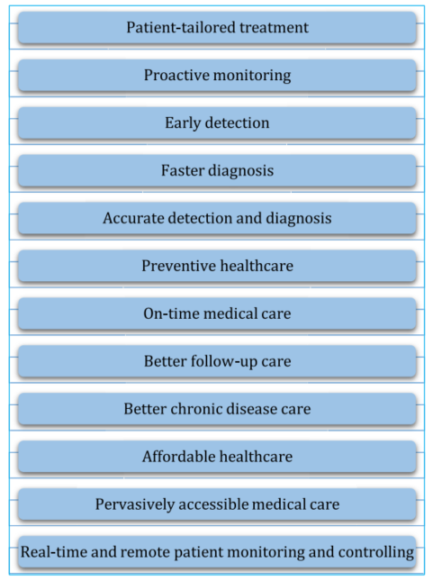

# The use of biosensors and nano-biosensors in IoNT system for healthcare
Nanotechnology involves the study and applications of matter on an atomic or molecular scale and often incorporates knowledge from multiple scientific disciplines like biology, physics, chemistry, medicine, and engineering in order to design, synthesis, characterization, and application of nanomaterials and nanodevices.
In the last decade, nanomaterials have been widely used in the fields of disease diagnostics, imaging, and therapeutics.

The main objective of nanotechnology is to exploit the advantages of miniaturized materials and devices to explore new possibilities.

## What are biosensors?
Biosensors are analytical devices which incorporate a biologically active element with an appropriate physical transducer to generate a measurable signal proportional to the concentration of chemical species around the sensor.

The key components are :
- <b>Bioelements</b> or <b>bioanalytes</b>, are the input of the sensor
- <b>Bioreceptors</b>, a bioelement like enzyme that recognizes and capture the analyte.
- <b>Transducer</b> a module for converting biochemical signals into measurable electrical signals.
- <b>Electronic System</b> that amplifies the electrical signal produced for further uses such as displaying, storing  and transmitting.

## What are nano-biosensors?
Nanobiosensors are the product of merging biosensors and nanotechnology. Using nanomaterials it’s possible to improve the sensibility of the biosensors and other vital attributes. This makes biosensors portable and implantable in the body so that early detection of diseases at the molecular level can be done, like cancer detection and others.

These have been instrumental in modern day healthcare, providing access to data from places that were unreachable or too risky to access before.

<table>
<tr><th>Advantages</th><th>Disadvantages</th></tr>
<tr><td>Ultra high sensitivity and control</td><td>Higher costs of the materials</td></tr>
<tr><td>Larger area to volume ratio and better use of the space</td><td>Lack of international guidelines for the materials</td></tr>
<tr><td>Better signal detection and transmission</td><td>Lack of information on toxicity levels and security standards</td></tr>
<tr><td>The nano-scale are more suited for in body implants</td><td>Public concerns and overall scrutiny</td></tr>
<tr><td>Rapid and high throughput detection</td><td></td></tr>
<tr><td>Low power consumption</td><td></td></tr>
</table>

## IoNT for healthcare using nano-biosensors
It’s easy to see how this technology can be used in the IoT field to create a more sensitive and useful system to monitor and analyze the surrounding environment. The merge of IoT and nano-sensors it's called Internet of Nano Things or IoNT. 

IoNT systems are used everywhere, but where they are most useful is in healthcare.
It provides nano-networking between different nano-biosensors implanted in and/or out of the body.
Every nano-biosensor works separately and gives different kind of data according to where they are placed.
Using the data coming from all of these different sensors, doctors can work accordingly, targeting specific issues without making the patient go through a systematic number of analysis and/or checks everyday.

Not only this but it enables specialists to detect issues before they become a critical problem for the safety of the patient.  

### Some applications
Some system ideas pitched in recent years are:

- A system for counting blood cell. The chip used  counts - whenever a blood cell generates a voltage when it passes through the electrode. With this doctors can analyze the blood flow of a patient and see if any infections or diseases are developing.
- A system for measuring electrolytes levels like sodium and potassium for real-time monitoring and quick time response for critically ill patients.
- A programmable bio-nanochips for early detecting and diagnosing of infectious or genetic diseases, such as cardiovascular diseases and more.
- A system of optical bio-nanosensors for detecting and separating cancer cells from healthy cells using the refraction index of each type of cancer cell.

## Challenges and risks
Although these solutions are really helpful, there are various challenges and risks associated with their use.
Some of these are:
- They are foreign objects and there is a strong likelihood that the immune system will react to it in a negative way. The repeated use of this may lead to the complete immunity to the system and may even weaken the immune system in the process.
- Another risk is the use of high frequency radio-waves for transferring data between the nano devices. The amount of  exposes the internal tissues to a high quantity of radiation, that can heavily damage the internal tissues and organs. 
- The nanomaterials like silicon, silver etc. can alter the normal functionalities of healthy cells in the body, and long exposure can lead to internal issues.
- Selecting the best location to place these sensor is not an easy choice. Placing them out of the body would be less intrusive, but not a lot of data can be accessed and exposes these devices to external factors that can damage them easily.
Placing them deep withing the body would be best for accessing more sensitive and important information, but not only it’s harder to get the sensors there, but it would be even more intrusive and dangerous when things go wrong.
A middle ground could be subcutaneous implants or superficial mucosa where they are easily accessible and can access a good amount of important information, without being too much intrusive to the patient.

